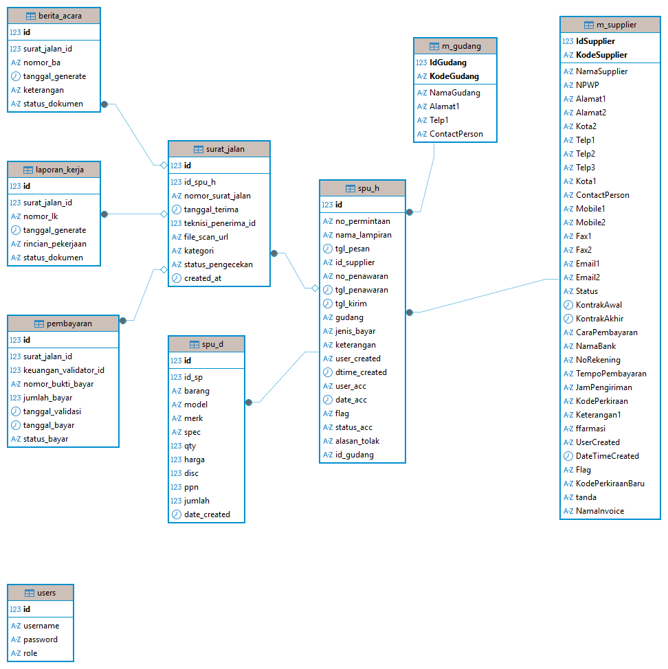
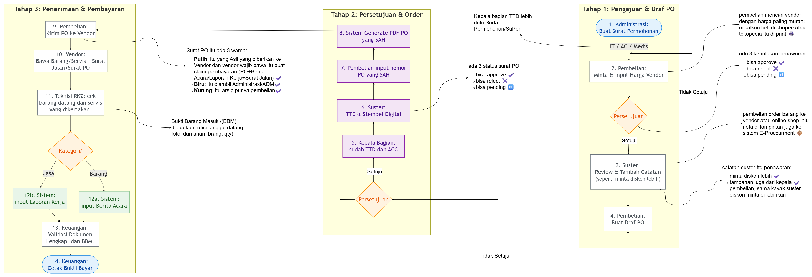

<div align="center">
  

  <h1>E-Procurement & Purchasing System</h1>
  <p>Sistem Informasi Manajemen Pengadaan Barang (E-Procurement), Surat Pesanan, Penerimaan Barang, hingga BAST terintegrasi.</p>

  <p>
    
    
    
    
  </p>
</div>

---

## 📖 Deskripsi Proyek
Sistem E-Procurement ini dibangun menggunakan PHP Native dengan pendekatan *Clean Architecture* berbasis API (RESTful JSON). Sistem ini dirancang secara khusus untuk memfasilitasi siklus pengadaan (Purchasing), mulai dari pembuatan Surat Pesanan (PO), sistem persetujuan berjenjang (Approval), hingga pelacakan Penerimaan Barang (Surat Jalan/GR).

Antarmuka pengguna (UI) dibangun secara modern, murni tanpa *framework* CSS berat, mengedepankan estetika bersih, fungsional, responsif, dan memberikan pengalaman setara *Single Page Application (SPA)* menggunakan AJAX.

## ✨ Fitur Utama
- **Manajemen Master Data:** Pengelolaan Master Gudang, Master Supplier, dan Pengguna (RBAC).
- **Surat Pesanan (PO) Terintegrasi:** Pembuatan pesanan lengkap dengan PPN dinamis, Diskon, pemilihan Gudang, auto-suggest pencarian, hingga lampiran dokumen PDF (Upload File).
- **Approval Workflow:** Sistem otorisasi berjenjang untuk menyetujui, menolak, atau me-reset pesanan yang telah dibuat.
- **Penerimaan Barang (Goods Receipt):** Pelacakan tanda terima fisik dari kurir (Surat Jalan) yang terhubung langsung ke PO yang disetujui.
- **Server-Side Pagination & Filtering:** Manajemen data dalam jumlah besar tanpa memberatkan browser.
- **Print & Export:** Cetak dokumen Surat Pesanan secara rapi, serta fitur Export tabel data pesanan.

## 🛠️ Tech Stack
*   **Backend:** PHP Native (Minimal v5.6+, direkomendasikan PHP 7.4/8.x)
*   **Database:** MySQL / MariaDB (Driver menggunakan `mysqli`)
*   **Frontend:** HTML5, Vanilla CSS3 (Custom Variables/Tokens), jQuery (AJAX & DOM Manipulations)
*   **Keamanan:** SQL Injection Prevention (`prepare` statements), RBAC (Role-Based Access Control)

## 📂 Struktur Direktori
Proyek ini memisahkan logika backend (*API endpoint*) dari antarmuka visual (UI):
```text
/
├── api/                  # Backend RESTful API endpoints (users, orders, supplier, upload, surat_jalan)
├── assets/css/           # Sistem Desain Utama (CSS Variables & Utilities)
├── components/           # Potongan antarmuka reusable (sidebar, topbar, dll)
├── database/             # File instalasi database (.sql)
├── img/                  # Aset gambar & ilustrasi visual
├── pages/                # Halaman UI Module Dashboard (home, list_pesanan, dll)
├── uploads/lampiran/     # Folder penyimpanan upload dokumen PDF
├── auth.php              # Logika pengecekan sesi & login/logout
├── config.php            # File konfigurasi koneksi Database
├── dashboard.php         # Kerangka dasar (Router & Layout Dashboard Utama)
└── index.php             # Halaman Login
```

## 🚀 Panduan Instalasi (Setup Lengkap)

1. **Persiapan Lingkungan**
   Pastikan Anda telah menginstal web server lokal seperti XAMPP, Laragon, atau LAMP stack, serta mengaktifkan modul Apache dan MySQL.

2. **Kloning Repositori**
   ```bash
   git clone https://github.com/username-anda/repo-sp_umum.git
   ```
   Letakkan folder proyek ini di dalam direktori root server Anda (misalnya `htdocs` untuk XAMPP).

3. **Konfigurasi Database**
   * Buka phpMyAdmin atau DBeaver.
   * Buat sebuah database baru, misalnya dengan nama `material`.
   * Lakukan impor (import) file skema yang ada pada folder `database/database_pembelian.sql`.
   * **Catatan:** Jangan lupa pastikan akun default yang tersedia sudah ter-generate (Contoh: `admin` / `123456`).

4. **Koneksi Aplikasi (config.php)**
   Buka file `config.php` pada editor teks Anda dan sesuaikan kredensial server MySQL Anda.
   ```php
   $db_host = 'localhost';
   $db_user = 'root';
   $db_pass = 'password_anda'; // Ubah sesuai pengaturan lokal
   $db_name = 'material';
   ```

5. **Pengaturan Konfigurasi Upload File (Opsional namun Disarankan)**
   Untuk memastikan fitur unggah dokumen (PDF) berjalan tanpa masalah ukuran:
   * Buka file `php.ini` Anda.
   * Pastikan `upload_max_filesize` di-set minimal ke `10M`.
   * Restart server Apache.

6. **Selesai!**
   Buka peramban (*browser*) dan jalankan `http://localhost/repo-pembelian`.

## 📌 Alur Kerja Sistem (Workflow)


1. Staf Umum membuat PO baru -> Status menjadi **Pending**.
2. Staf Atasan / Admin membuka menu Approval -> Melakukan pengecekan -> Mengubah status menjadi **Approved**.
3. PO yang *Approved* secara otomatis dapat dicari saat kurir datang -> Dibuatkan dokumen **Surat Jalan / Penerimaan Barang**.
4. (Tahapan BAST / Pembayaran selanjutnya bisa dikembangkan berdasarkan alur Surat Jalan).

## 📄 Lisensi
Sistem E-Procurement ini dibuat dan dikelola sebagai aset *proprietary* / panduan internal. Segala bentuk modifikasi untuk kebutuhan publik diatur melalui kebijakan lisensi repositori Anda (misalnya: MIT License).

---
*Dibuat dengan ❤️ oleh Louis.*
