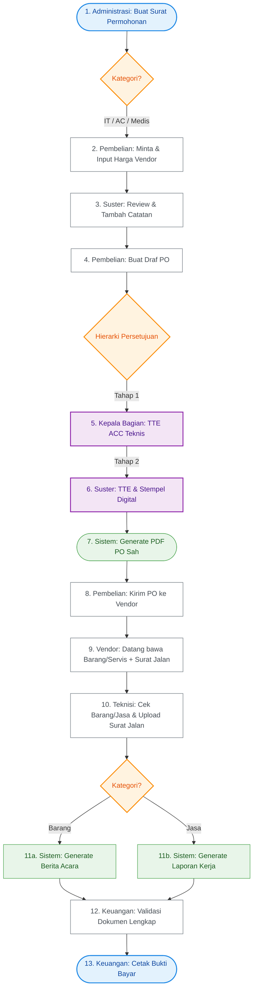
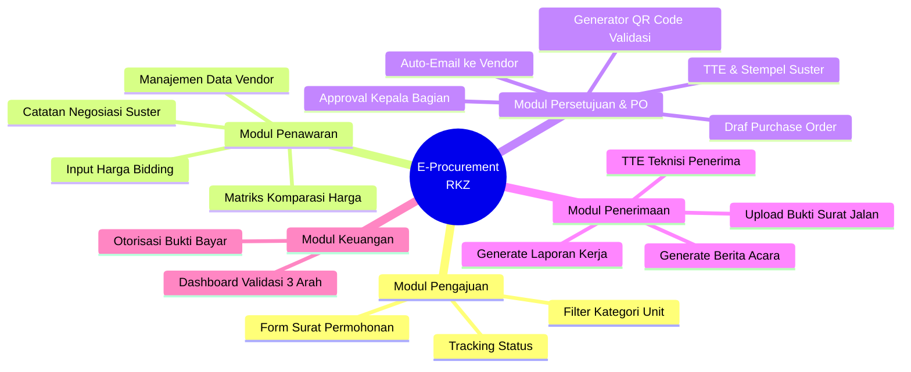

# E-Procurement RKZ System Diagrams

## Diagram 1: System Workflow (Flowchart)

```mermaid
graph TD
    classDef default fill:#f8f9fa,stroke:#adb5bd,stroke-width:1px,color:#212529;
    classDef start_end fill:#e3f2fd,stroke:#1e88e5,stroke-width:2px,color:#0d47a1;
    classDef process fill:#ffffff,stroke:#6c757d,stroke-width:1px,color:#495057;
    classDef decision fill:#fff3e0,stroke:#fb8c00,stroke-width:2px,color:#e65100;
    classDef system fill:#e8f5e9,stroke:#43a047,stroke-width:1px,color:#1b5e20;
    classDef approval fill:#f3e5f5,stroke:#8e24aa,stroke-width:2px,color:#4a148c;
    
    A([1. Administrasi: Buat Surat Permohonan]):::start_end --> B{Kategori?}:::decision
    B -->|IT / AC / Medis| C[2. Pembelian: Minta & Input Harga Vendor]:::process
    C --> D[3. Suster: Review & Tambah Catatan]:::process
    D --> E[4. Pembelian: Buat Draf PO]:::process
    
    E --> F{Hierarki Persetujuan}:::decision
    F -->|Tahap 1| G[5. Kepala Bagian: TTE ACC Teknis]:::approval
    G -->|Tahap 2| H[6. Suster: TTE & Stempel Digital]:::approval
    
    H --> I([7. Sistem: Generate PDF PO Sah]):::system
    I --> J[8. Pembelian: Kirim PO ke Vendor]:::process
    J --> K[9. Vendor: Datang bawa Barang/Servis + Surat Jalan]:::process
    
    K --> L[10. Teknisi: Cek Barang/Jasa & Upload Surat Jalan]:::process
    L --> M{Kategori?}:::decision
    M -->|Barang| N[11a. Sistem: Generate Berita Acara]:::system
    M -->|Jasa| O[11b. Sistem: Generate Laporan Kerja]:::system
    
    N --> P[12. Keuangan: Validasi Dokumen Lengkap]:::process
    O --> P
    P --> Q([13. Keuangan: Cetak Bukti Bayar]):::start_end
```

## Diagram 2: System Modules (Mindmap)

```mermaid
mindmap
  root((E-Procurement<br/>RKZ))
    Modul Pengajuan
      Form Surat Permohonan
      Filter Kategori Unit
      Tracking Status
    Modul Penawaran
      Manajemen Data Vendor
      Input Harga Bidding
      Matriks Komparasi Harga
      Catatan Negosiasi Suster
    Modul Persetujuan & PO
      Draf Purchase Order
      Approval Kepala Bagian
      TTE & Stempel Suster
      Generator QR Code Validasi
      Auto-Email ke Vendor
    Modul Penerimaan
      Upload Bukti Surat Jalan
      Generate Berita Acara
      Generate Laporan Kerja
      TTE Teknisi Penerima
    Modul Keuangan
      Dashboard Validasi 3 Arah
      Otorisasi Bukti Bayar
```
